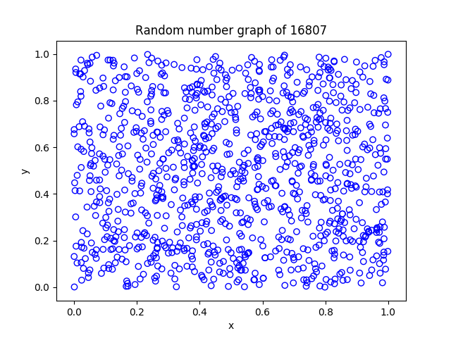
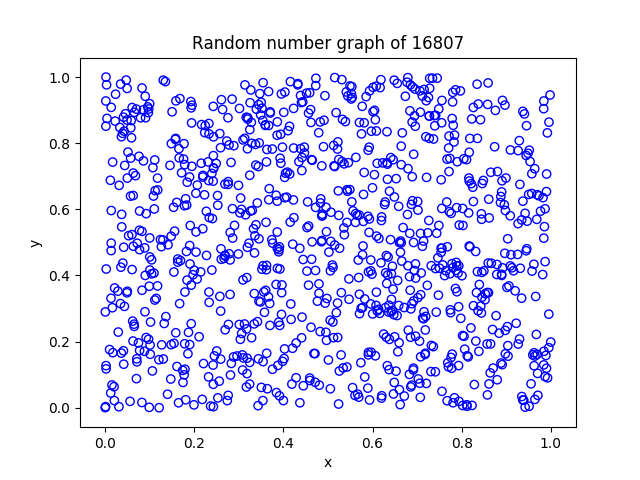
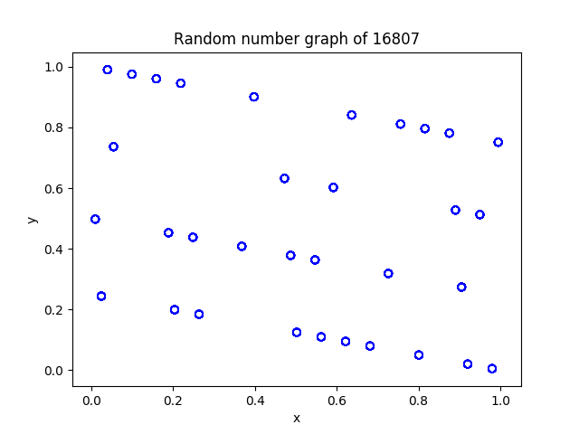

# 计算物理HW1

**古宜民 PB17000002**

**2019.9.14**

## 1. 作业题目

1 、用 Schrage 方法编写随机数子程序,用连续两个随机数作为点
的坐标值绘出若干点的平面分布图。再用 $<x_k> $测试均匀性(取
不同量级的 N 值,讨论偏差与 N 的关系)、 C(l) 测试其 2 维独立性
(总点数 N > 10E7 )。

2 、用 16807 产生器测试随机数序列中满足关系 X n-1<X+1<X n
的比重。讨论 Fibonacci 延迟产生器中出现这种关系的比重。

## 2. 算法及公式

Lehmer线性同余随机数生成器：

$I_{n+1}=(aI_n+b)\mod m$

$x_n=I_n/m$

为了产生全整数范围内的随机数，并且方便计算机计算而不发生整数溢出，使用Schrage方法算$a*z\mod m$:

$az\mod m=a(z\mod q)-r[z/q], if \ge 0; a(z\mod q)-r[z/q]+m, otherwise$

取a=16807，m=2147483647，即得到16807产生器。在程序实现上较为容易。

Fibonacci延迟产生器：

$I_n=I_{n-p}\otimes I_{n-q}\mod m$

p，q的取值经统计验证后确认，其实很难找。

程序实现上为了address到过去的$I$值，需要把一系列$I$值都存起来，比如使用线性存储的循环队列很方便。但是对Fibonacci生成器而言，由于使用了n-p和n-q这两个之前的值，需要n>max(p,q)，这样导致前max(p,q)个值需要手动初始化才能使生成器正常工作。我的程序里直接用了16803生成器进行初始化，或许有基于数学计算的更好的方案。

独立性检验只要带入公式计算就可以了。

关于$<x^k>$，从图像意义上看相当于在区间[0,1]内撒点，然后点的权重是$x^k$，所以期待值应该是$\int_0^1x^kdx=\frac1{n+1}$，而C(l)是越小越好。

## 3.计算结果和分析

16807生成器，取10000个点、100个点（20000，2000个随机数）作图：可以看出随机性还是不错的，没有明显的规律

但是实验中发现，**如果取了IBM那个随机性并不好的生成器，画出来的图也和这个差不多**，所以这个图也并不能完全表现出来随机性到底好不好。


1000个点：



IBM 1000个点：



自己随便取了一组a=50,m=201，发现效果很差，图是这样的：

和老师上课给出的例子类似，有明显的规律，点分布在4条直线上。



随机性检验的结果：

N=2E7:

```
k=1 avg(x^k)=0.499955
k=2 avg(x^k)=0.333269
k=3 avg(x^k)=0.249931
k=4 avg(x^k)=0.199929
C(1)=0.000065
C(2)=-0.000184
C(3)=0.000232
C(4)=0.000205
C(5)=0.000058
C(6)=-0.000042
C(7)=-0.000111
C(8)=0.000168
C(9)=0.000085
C(10)=-0.000360
C(11)=-0.000436
C(12)=-0.000017
C(13)=-0.000063
C(14)=0.000072
C(15)=0.000074
C(16)=0.000131
C(17)=0.000090
C(18)=-0.000120
C(19)=0.000118
```

N=2E5:

```
k=1 avg(x^k)=0.500367
k=2 avg(x^k)=0.333658
k=3 avg(x^k)=0.250235
k=4 avg(x^k)=0.200160
C(1)=-0.001213
C(2)=-0.002795
C(3)=-0.001327
C(4)=0.001004
C(5)=0.000209
C(6)=0.000399
C(7)=-0.000859
C(8)=-0.002559
C(9)=0.001061
C(10)=0.001507
C(11)=-0.000375
C(12)=0.000113
C(13)=-0.003300
C(14)=0.000338
C(15)=0.001562
C(16)=0.003365
C(17)=-0.002183
C(18)=-0.001124
C(19)=-0.002423
```

N=2E3:

```
k=1 avg(x^k)=0.501303
k=2 avg(x^k)=0.332410
k=3 avg(x^k)=0.247795
k=4 avg(x^k)=0.197186
C(1)=0.029046
C(2)=-0.023850
C(3)=-0.018499
C(4)=0.033156
C(5)=-0.011746
C(6)=-0.004466
C(7)=0.007960
C(8)=-0.000312
C(9)=0.037824
C(10)=-0.033604
C(11)=0.015228
C(12)=0.007357
C(13)=0.040958
C(14)=0.032251
C(15)=0.053307
C(16)=0.033781
C(17)=-0.007744
C(18)=0.012917
C(19)=-0.003188
```

可以看出，随着N增大两个量级，$<x^k>$的偏差下降：0.03->0.0006->0.00007，不同C(l)也均下降。

并且随着C(l)的参数l不同，关联程度时大时小，所以只看二维关联是不足以衡量随机数质量的。

同时，用同样的方法检验了系统`rand()`函数的行为：

N=2E7

```
k=1 avg(x^k)=0.500039
k=2 avg(x^k)=0.333361
k=3 avg(x^k)=0.250020
k=4 avg(x^k)=0.200016
C(1)=-0.000194
C(2)=0.000107
C(3)=-0.000148
C(4)=-0.000030
C(5)=-0.000061
C(6)=0.000158
C(7)=0.000093
C(8)=-0.000069
C(9)=0.000244
C(10)=-0.000037
C(11)=-0.000011
C(12)=0.000139
C(13)=0.000081
C(14)=0.000216
C(15)=0.000046
C(16)=-0.000191
C(17)=-0.000204
C(18)=-0.000296
C(19)=0.000245
```

可见偏差和16807生成器在一个量级上，相差不大。速度上rand()快一些，但我的程序没有任何优化，所以不能确定算法上哪个更快。

---

Fibonacci生成器，p和q随意取，运算符取加法，计算满足$x_{n-1}<x_{n+1}<x_n$所占比重。直接程序生成一系列随机数计算即可。

理论期望：要求三个[0,1]随机数中，中间的一个大于旁边两个，即三位空间$[0,1]^3$中的一个随机点，座标y>x且y>z，对应空间中区域为一个四棱锥，其体积，对应概率，为$\frac16$。

N=2E7，16807和Fibonacci生成器的结果为占比分别0.166661，0.166693。Fibonacci生成器中改变p和q，结果类似，在0.1666-0.1667左右，相比理论值0.16666...偏差大于16807生成器。改变运算符为XOR，发现结果波动很大，有时甚至达到0.19以上，但也出现了比较好的0.166667。可见Fibonacci的参数较难选择。

## 4. 结论

- 16807生成器的质量较好
- Fibonacci生成器的参数不易调节
- 平面分布图法可以观察随机性，但也不是万能的

## 5. 其他

翻了一下glibc源码，在`stdlib/random_r.c`里的`int __random_r (struct random_data *buf, int32_t *result)`是随机数函数，其中一部分就是我们用的线性生成器（取模用的位运算），

```c
 ((state[0] * 1103515245U) + 12345U) & 0x7fffffff
```

其他的没看懂，网上查是这样的：

```c
for (i=344; i<MAX; i++)
{
    r[i] = r[i-31] + r[i-3];
    val = ((unsigned int) r[i]) >> 1;
}
```

和Fibonacci有点像不过应该更高级一些。

这个初始化也比较复杂。

另外，程序实现里用unsigned会方便很多，两个signed相加正好不会超过unsigned，然后取模再回到signed范围。我程序里有的地方简单起见直接开了long long其实并不好。