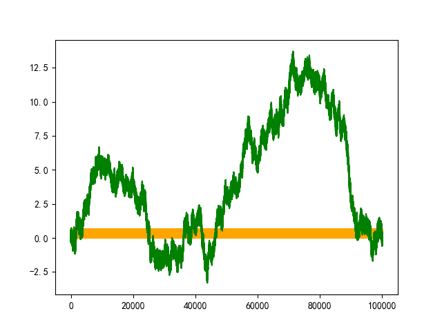
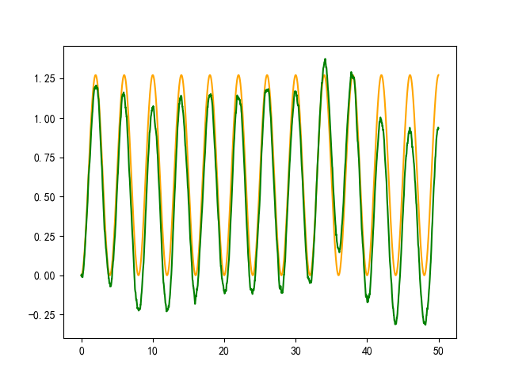
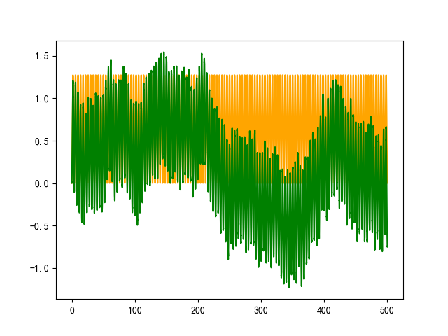
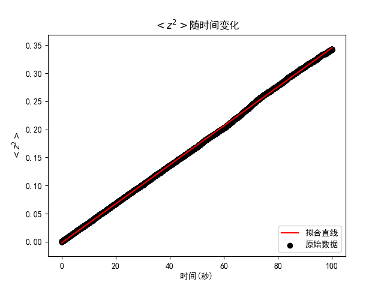
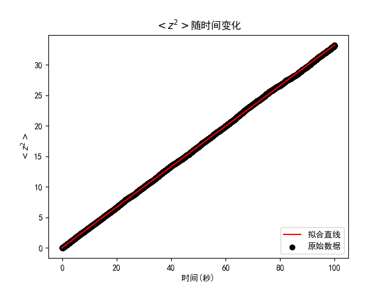
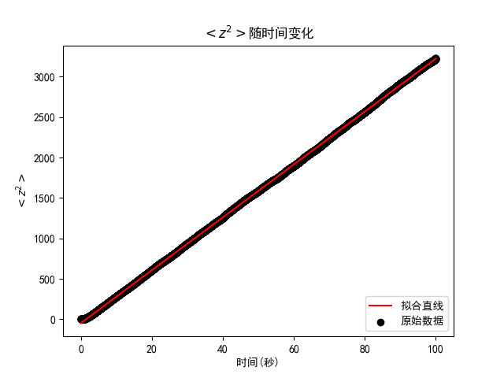
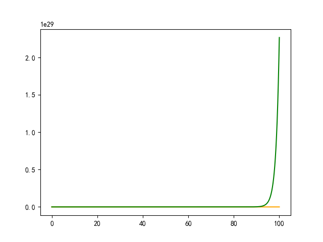
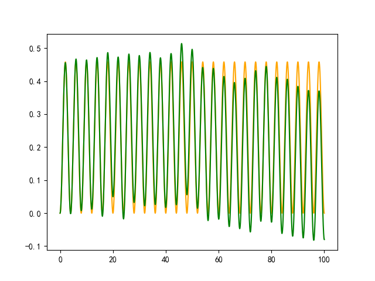

# HW10-1

古宜民

2019.10.17

## 题目

Monte Carlo 方法研究正弦外力场( ~ $sin\omega t$)中的随机行走。

## 分析&算法

**理论分析**

为了对系统进行模拟，我们首先要从理论上推导粒子在正弦外力场中的运动。

首先考虑没有涨落力，只有周期性外力F和阻力$-\alpha v$的情况。

粒子的运动方程为：

$m\frac{d^2x}{dt^2}=F_0sin\omega t-\alpha \frac{dx}{dt}$

这个二阶方程可以直接求解（使用通解+特解的方法，特解可猜测为$Asin\omega t+Bcos\omega t$），得到粒子运动位置随时间变化：

$x_a(t)=-\frac{F_0}m \frac1{\omega^2+(\frac\alpha m)^2}(sin\omega t+\frac\alpha{m\omega}cos\omega t)+x_1+x_2e^{-\frac\alpha mt}$

求导可得速度：

$v_a(t)=-\frac{F_0}{m}\frac1{\omega^2+(\frac\alpha m)^2}(\omega cos\omega t-\frac\alpha {m\omega}sin\omega t)-\frac\alpha mx_2e^{-\frac\alpha mt}$

其中$x_1,x_2$为取决于初始条件的任意常数。如果给定的初始条件是初始位置$x_0$和速度$v_0$，那么有：

$x_2=-\frac m\alpha(v_0+\frac{F0}{m}\frac1{\omega^2+(\frac\alpha m)^2}\omega)$

$x_1=\frac{F0}{m}\frac1{\omega^2+(\frac\alpha m)^2}\frac a{m\omega}+x_0-x_2$

于是，在考虑涨落力求解Brown运动方程时，可以进行变量代换：

$x=x_a+z$

代入Brown方程

$m\frac{d^2x}{dt^2}=F_0sin\omega t-\alpha \frac{dx}{dt}+F$，F为涨落力

可得：

$m\frac{d^2z}{dt^2}=F-\alpha\frac{dz}{dt}$

可见通过变量代换，我们把外力场中粒子的Brown方程化为了与自由粒子相同的方程。这样，按照讲义上的推导，我们可以得到$<z^2(t)>=2Dt,D=\frac{k_BT}{\alpha}$。通过计算这个平方平均值，我们可以检查模拟结果与理论结果是否符合。

**模拟实现**

对于变量z，模拟如同常规自由粒子的布朗运动，每一步有1/2的概率往左走一步或往右走一步。但如果这样，对z进行模拟，加上$x_a$得到原本$x$的运动，然后又减去$x_a$得到z求平方平均来表征模拟结果未免太无聊了。

所以，可以较为底层地，使用原始的运动方程，使用随机分布的涨落力，直接对运动方程进行模拟，然后检查结果。

因为涉及到对微分方程的模拟，可以使用经典四阶Runge-Kutta方法。取时间步长为h，速度v为因变量，则
$$
v'=\frac{F_0}msin\omega t-\frac\alpha mv+\frac Fm=f(t,v) \\
v_{n+1}=v_{n}+\frac h6(k_1+2k_2+2k_3+k_4) \\
k_1=f(t_n,v_n) \\
k_2=f(t_n+\frac h2,v_n+\frac h2k_1) \\
k_3=f(t_n+\frac h2,v_n+\frac h2k_2) \\
k_4=f(t_n+h,v_n+hk_3) \\
$$
F的随机性体现在对于每一部计算，f中的F是随机的，在[-Fm,Fm]中随机取值。

于是求得了计算机模拟的速度。至于位置，可以直接对速度积分求得，使用一个梯形公式即可很好的完成积分。在其他方面，程序实现并无困难。

使用Monte-Carlo得到了大量次数的模拟结果之后，即可计算出布朗运动与理论运动的偏差z，进而计算出$<\Delta z^2>$，将计算结果与理论值$2Dt$比较，可以表征模拟的结果。

## 计算结果

**粒子位置随时间变化**

一个典型的长时间结果（迭代10^7步，用时30秒左右，横轴为时间秒，纵轴为位移）：

橙色为没有涨落力的情况，呈周期运动，因为周期相对模拟时间很短，所以只看到一条粗线，绿色为涨落力作用下的运动。因为随机性的原因，每次模拟的具体结果不相同。

短时间的图：



从短时图像看，可见涨落力在理论运动上叠加了一个随机运动。这与我们的期望是相同的。

中等时间的图：



**$<z^2>$随时间变化**

将布朗运动结果与理论无干扰结果相减并平方得到$z^2$随时间变化，进行Monte-Calro计算得到$z^2$的平均值，作图观察。



$F_m=1,F_0=1,w=\frac{\pi}2,a=1,h=0.01,v_0=0; k=0.00347$



$F_m=1,F_0=1,w=\frac{\pi}2,a=0.1,h=0.01,v_0=0; k=0.332$



$F_m=1,F_0=1,w=\frac{\pi}2,a=0.01,h=0.01,v_0=0; k=32.7$

从图中可见，$<z^2>$与t成正比，这与理论相符。

但同时发现，正比的比例系数2D随着阻力系数$\alpha$以二次方减小：$\alpha$减小一个量级，斜率增大二个量级。这与理论值D与$\alpha$成一次方反比有不同。产生这种不同的原因并不清楚，一个猜想是可能RK模拟的随机力实现方式与真实情况有所差别。

同理改变其他变量，可以得出$<z^2>$与$F_m$二次方成正比、与质量m无关。这些趋势也是与直观预期相符的。

**一个问题**

在计算中发现，当阻力系数$\alpha$大于某特定值而理论的周期性震荡消失，物体位置随时间趋近于0，这时在RK方法模拟微分方程时，会发生发散。猜测的原因是在物体位置以及速度极小时，计算精度会因浮点误差急剧增大，引起结果指数发散。

$\alpha=2.79$的图



$\alpha=2.78$的图



## 结论&其他

本实验中使用了RK方法模拟了正弦外力场中粒子的布朗运动，并计算相关物理量与理论值进行对比。整体结果是与理论符合的，但也存在着与理论不相符的地方，还需进一步深入研究。

**其他**

关于程序效率：这个程序写得比较中规中矩，结构很清晰，但因此几乎没有做任何优化，作为一个计算程序，个别地方已经低效到了让我不想看的程度。很多重复计算，内存没有优化，函数调用过多，内存可以节省到O(1)量级但这里直接开了O(N)。这种Monte-Calro程序对并行和SIMD也是及其友好的，预计全套优化下来速度有10-20倍的提升空间。目前情况，RK迭代10^4次，MC重复10^4次，用时30秒，开O3用时20秒，现在算是可以接受。

程序使用和作图方法：

```
pip3 install physicsexp
gcc hw10.c -lm -O3
./a.out single | ./plot2.py
./a.out z2avg | ./plot.py
```

