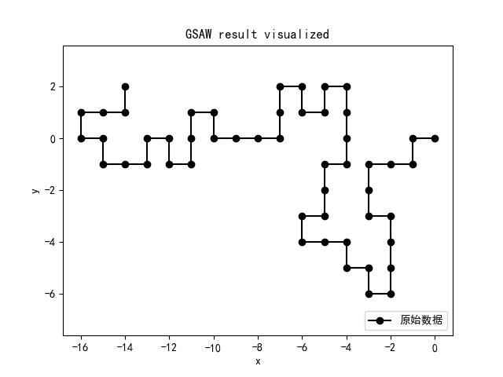
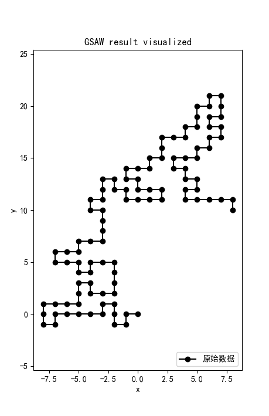
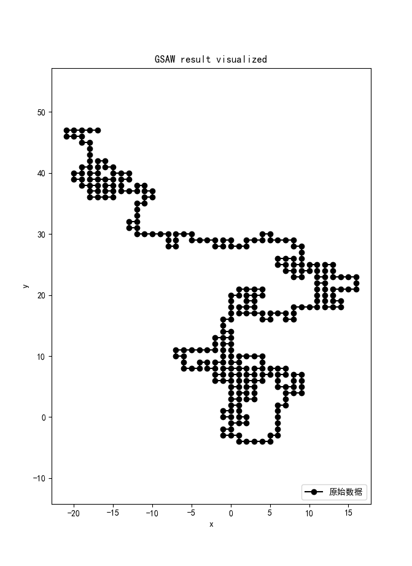
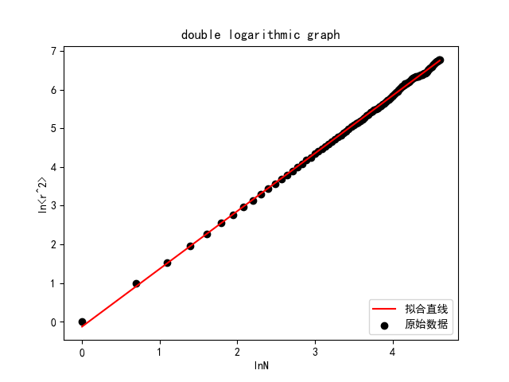
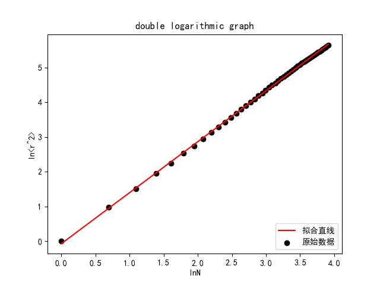

# HW11-1

古宜民

2019.10.27

## 题目

 计算 2 维正方格子中 GSAW 的指数值,并定性地加以讨论。

## 分析&算法

**理论分析**

对于这道题目，只要按照讲义上的内容对GSAW进行模拟，记录行走历史，再按要求求出N和$<r^2>$，然后进行分析即可。为了提高计算效率，使用权重法模拟大量行走。使用Monte-Carlo方法，设链长为N，进行M次随机行走。在每次随机行走中，需要记录的是每一步n(0<n<N+1)时粒子到远点的距离r，以及当前点的权重。之后对M次模拟求平均值，即可得到所需要的$<r^2>$。

待求的指数值理论为

$<r^2(N)>=aN^{2\nu}(1+bN^{-\Delta})$

在N不大的情况可以忽略高阶修正，从而可以通过$log<r^2(N)>-logN$对数曲线作图，并用比值法或线性拟合法求出斜率，即为$k=2\nu$。

**模拟实现**

程序实现上，对于每次长度为N的随机行模拟，需要记录全部的历史，并在模拟过程中，每新走一步，都要检测四周是否有之前走过而不能再经过的点。如果没有可走的路径，那么本次SAW模拟失败。如果使用最少的内存，可以用O(N)空间记录历史，但是查找时需要$O(N^2)$的时间对历史进行线性查找。而这是很浪费时间的。如果使用空间换时间，则可以使用一个$(2N)^2$大小的地图数组来记录历史，这样可以以常数时间进行查找，但是内存使用就要到$O(N^2)$量级了。如果N=10000，就需要1.5G内存。但综合考虑，如果N很大时，限制因素是SAW失败的概率非常大，N=300时基本需要百余次左右尝试才能成功，而N=500时模拟根本无法得到一组成功的SAW。因此用时间换取空间是非常合适的。

## 计算结果

**结果概览**

打印出整条SAW路径并作图，得到以下图像：

长度N=50

N=100

N=300

从图片可以直观的的看到SAW自规避的特点。

**$<r^2(N)>$随$N$变化**

使用对数座标对$log<r^2(N)>-logN$作图如下：

N=100，Monte-Carlo次数M=3000，拟合斜率1.495

,

N=50，M=5000，拟合斜率1.468

可见结果为对数座标中的直线。并且拟合得到的斜率（除以2之后）与二维SAW的理论值0.75相符合。N=100时，拟合得到的斜率为0.748，与理论值十分接近。

## 结论&其他

本实验中使用了RK方法模拟了正弦外力场中粒子的布朗运动，并计算相关物理量与理论值进行对比。整体结果是与理论符合的，但也存在着与理论不相符的地方，还需进一步深入研究。
