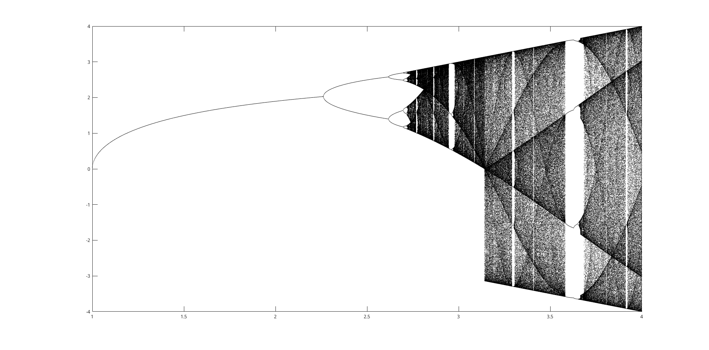
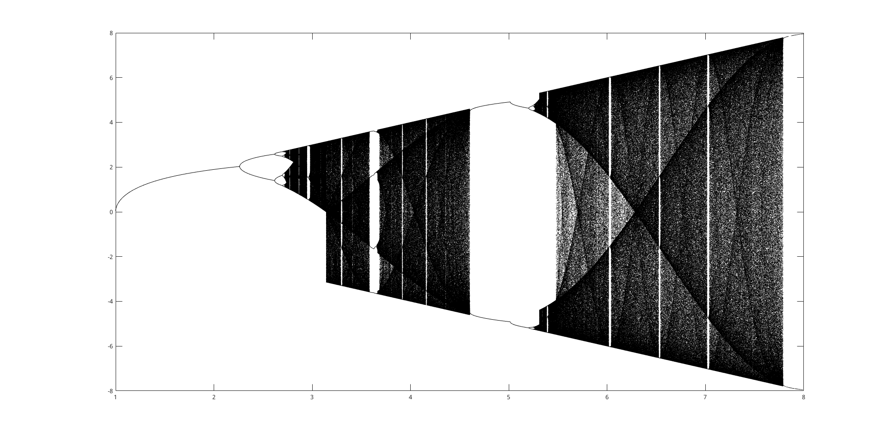
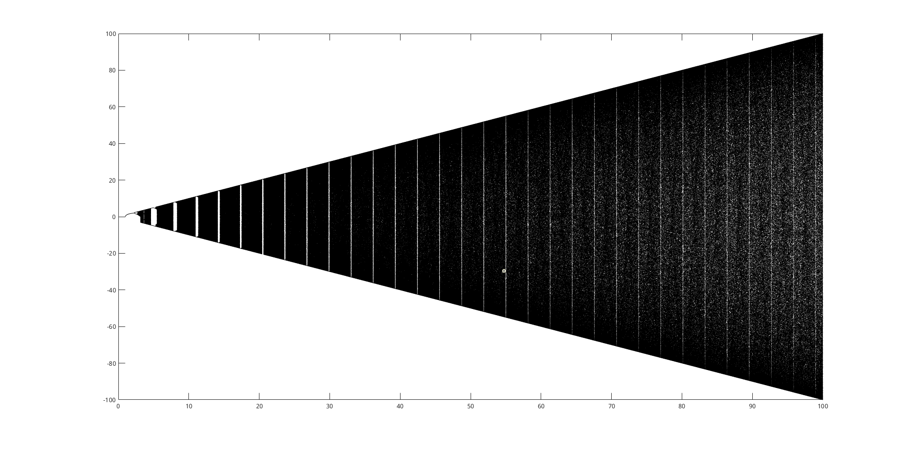
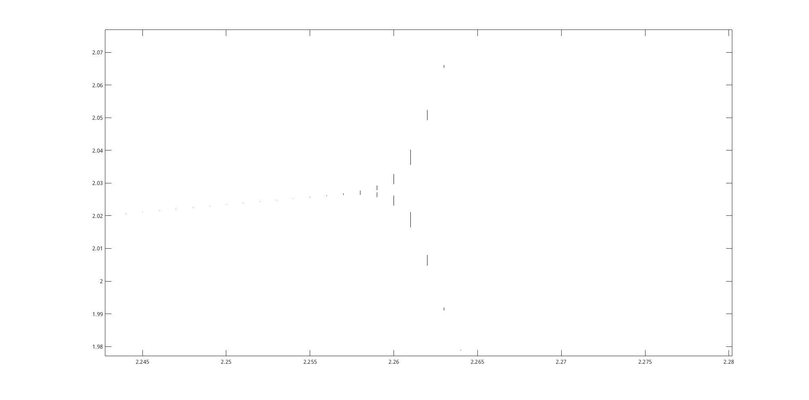
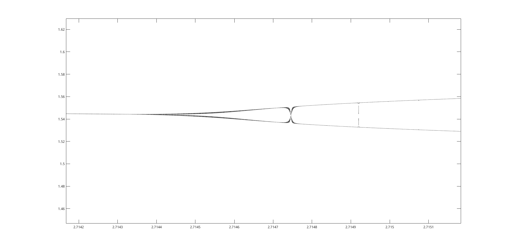

# HW12

古宜民

2019.11.2

## 题目

[第 12 题]：以$x_{n+1}=\lambda sin(\pi x_n)$为迭代方程：
(1)画出系统状态随参数$\lambda$的变化图，要求包括定值状态、倍周期分叉和混沌状态；
(2)列出各个倍周期分叉处的$\lambda$值，求相应的 Feigenbaum 

## 分析&算法

**理论分析与实践方法**

对于这道题目，为了作出变化图，就需要对不同的$\lambda$参数进行迭代并记录结果：即若干个定值状态，以及可能出现的混沌状态。期待的最终的目标图为二维图，x轴为$\lambda$，y轴为若干个定值或一片混沌。

对于定值状态的情况，随着迭代次数增加，$x$趋向于在若干个定值间周期性取值；而开始的一些值并不规则。对于混沌状态，则是所有的值都无任何规律。为了在图像上清楚的看到这一点，可以采取如下策略：对一个$\lambda$总共迭代N次，其中前M次作为“预热”，而把后N-M次的结果$x_i$都放在图像上，即点$(\lambda,x_i)$。于是，对于周期性的稳定点，N-M个画图点在分布在若干个定值状态，看到的效果就是若干个定值点；而混沌情况，则可以看到一片不规则的点，因为并没有周期出现。

为了获得倍周期分叉处的$\lambda$值，可以直接从图像上观察。观察精度取决于对$\lambda$取样的精度。如果要进一步提高精度，可以改变$\lambda$的模拟范围，同时提高精度。这种类似二分查找的方法可以在可以接受的程序运行时间内获得很高的精度。

## 计算结果

**结果概览**

$\lambda$范围1-4，1-8，1-100的图像：

从图中可见，随着$\lambda$从1开始增大，定值状态从1个开始分叉，分叉逐渐增加，而后产生混沌。而混沌中又会突然进入稳定状态一段时间，之后再次混沌。并且稳定状态构成的“带”有一些周期性结构，既有小幅的周期，如1-8图中右侧可见三条稳定带。也有大幅周期，如1-100图中，小幅周期完全不可见，取而代之的是一些大周期的周期性结构，即图中的白色竖线。

而在混沌状态中，黑色点的密度，即颜色的深浅，也是有一定规律的。1-4图中可见混沌中也有各种各样的条纹分布。并且，随$\lambda$增大，混沌的范围（即图中x的范围，黑色带）可能发生突变，如1-4图中$\lambda=3.1$左右的位置。

从这些可见，这一生成过程相对非常简单的图中包含了及其多的信息。

放大局部，可见分叉的过程细节：

离散的$\lambda$是因为模拟导致，而每段竖线其实是非常密集的点。该模拟结果对应于真实的数学情况是周期性的稳定点并不完美，而当迭代步数趋向于无穷时，才体现出完美周期性。所以在有限的模拟中，体现为一些有长度的线段。

在放大图中，我出乎意料的发现分叉处附近并不一定是直线，而是会出现意想不到的精细的结构（经检验不是程序误差或参数取值不够好导致）：

**参数计算**

通过图像放大观察，并不断缩小范围、增加取样密度重新作图，记录分叉位置，各个分叉处$\lambda$值以及根据Feigenbaum常数计算公式算得比值为：

|m|$\lambda_m$|$\frac{\lambda_{m}-\lambda_{m-1}}{\lambda_{m+1}-\lambda{m}}$|
| ---- | ---- | ---- |
|1|2.258|      |
|2|2.616| 4.420 |
|3|2.697| 4.655 |
|4|2.7144|4.579|
|5|2.7182|4.222(x)|
|6|2.7191|6(x)|
|7|2.71925||

由于取样精度低，只有前三个值比较准确。估计的Feigenbaum常数在4.4-4.7之间。

## 结论&其他

本实验中通过简单的代码（不到20行核心代码），就模拟并观看到了及其复杂的图形，并尝试性的计算了相关系数。

本次一大难点在于画图。将几十兆的数据快速的画图不是什么软件都能实现的。比如我之前惯用的matplotlib，虽然能画出“publication quality”的图，但速度却是硬伤。对于这个量级的图根本无法绘制，加了所谓的优化参数也是杯水车薪，甚至因此导致我的图形界面（Gnome3.34 on Xorg）崩溃。经过查找，发现pyqtplot和vispy等python库画图较为快速，但奈何代码繁琐（比如需要Qt写图形界面）、资料少、较为小众，就没有研究下去。反而求助于我不经常用Matlab，发现效果还是很好的，速度很快，也很美观。本文中所有图都是Matlab所画。