# HW13

古宜民

2019.11.8

## 题目

[第13题] 进行单中心DLA模型的模拟(可 以用圆形边界，也可以用正方形边界)，并用两种方法计算模拟得到的DLA图形的分 形维数，求分形维数时需要作出双对数图。

## 分析&算法

**理论分析**

本次任务是进行DLA模型模拟。思路比较直接：在一个平面上，放置初始生长中心，然后取一个边界不断地产生粒子，粒子从边界产生后开始随机行走，行走中如果碰到生长中心，则粒子游走结束，粘在生长中心上，成为生长的一部分。反复这一过程若干次，直到生长中心变得较大，生长结束。

生长之后，使用面积-回转半径法计算分形维数。因为单中心生长分形质心就是放置初始生长中心的位置，可以直接用公式$R_g^2=\frac{\Sigma r_i^2}{N}$计算。而这里的粒子是离散生长的，所以每一步时面积就是当前生长的粒子数。

**程序实现**

程序实现上，和之前几次作业类似，在一片大空间（二维数组，本程序中除非特殊说明都为400x400）上用比特位标记是否有粒子。标记初始生长中心，然后从空间周围矩形或圆形区产生粒子，模拟随机游走直到成功。如果游走到了边界，就（简单起见）回溯一步重新游走。为了记录每一步时的回转半径，每游走一个粒子，就要更新一下计算的回转半径。计算结束之后，用MATLAB对数据进行简单画图和对数座标线性拟合。

为了可视化结果和生长过程，使用了OpenCV库进行绘图，用点的颜色渐变可以看出生长的先后。同样，画图也可以随程序运行动态展示，可以直观地看到生长过程。

本程序要进行大量随机游走，每次要持续游走直到与生长部分发生碰撞。这使得程序所需时间较长，尤其是开始的时候生长部分很小，需要较长时间才能游走成功。这似乎是不可避免的问题。由于粒子必须一个一个行走，并行似乎并不现实。

因为初始生长中心是随意选取的，本程序可以很方便的看到各种初始条件导致的生长图像。

## 模拟结果

**结果概览**

用不同的边界条件、不同的粒子数、不同的生长中心进行生长模拟。结果如下。渐变的颜色表示粒子的先后顺序（RGB从第一个粒子到最后一个线性变化）。

矩形边界，5k粒子

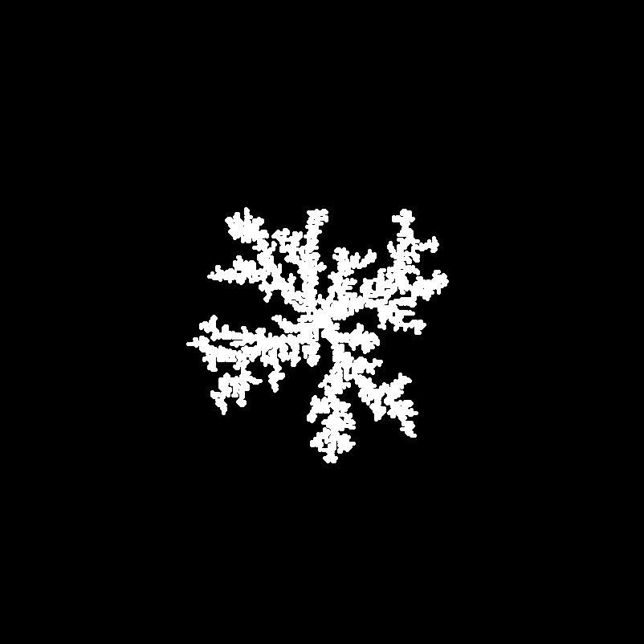

矩形边界，10k粒子

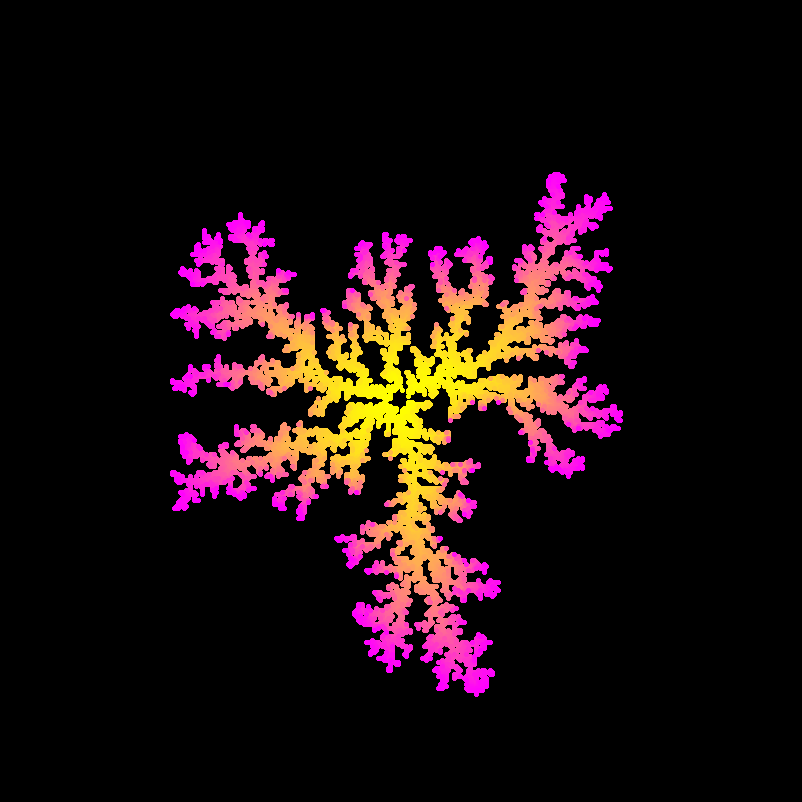

矩形边界，20k粒子

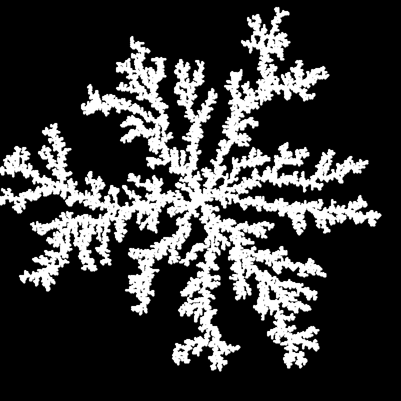

圆形边界，5k粒子

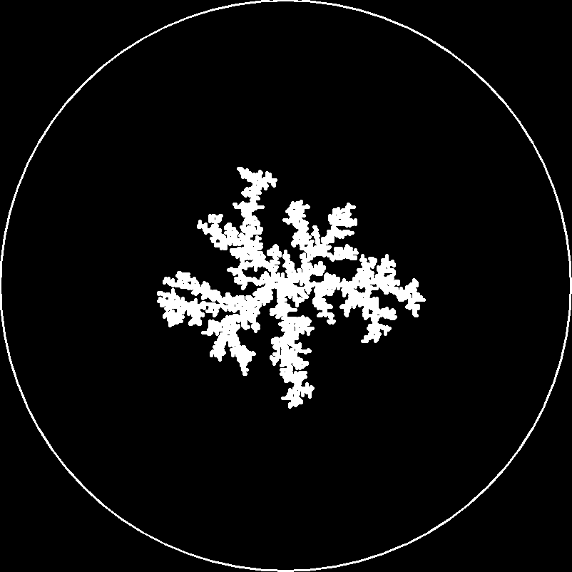

圆形边界，10k粒子

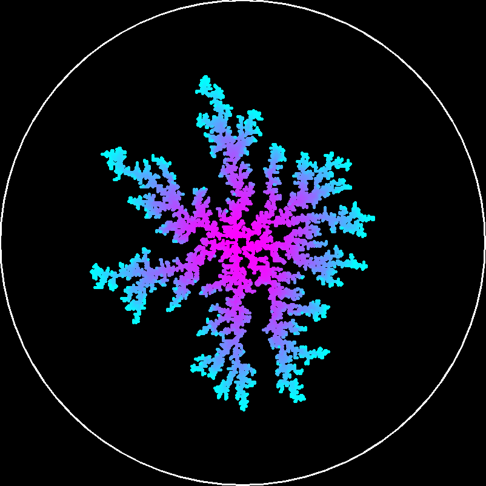

圆形边界，20k粒子

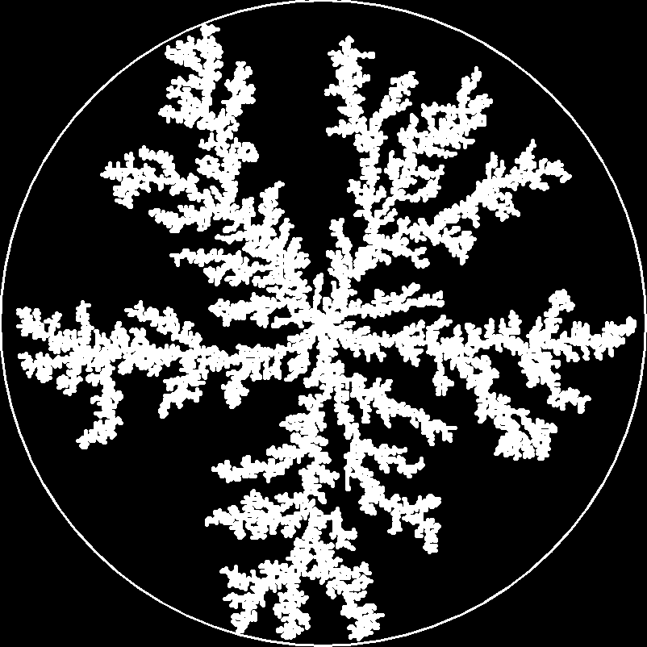

一条直线为生长中心，圆形边界，10k粒子

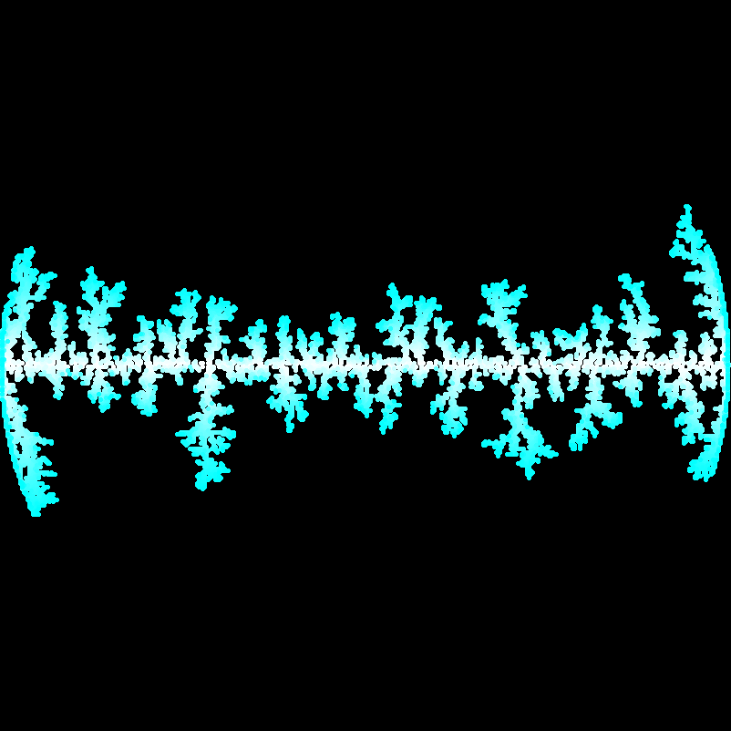

半圆弧为生长中心，矩形边界，10k粒子

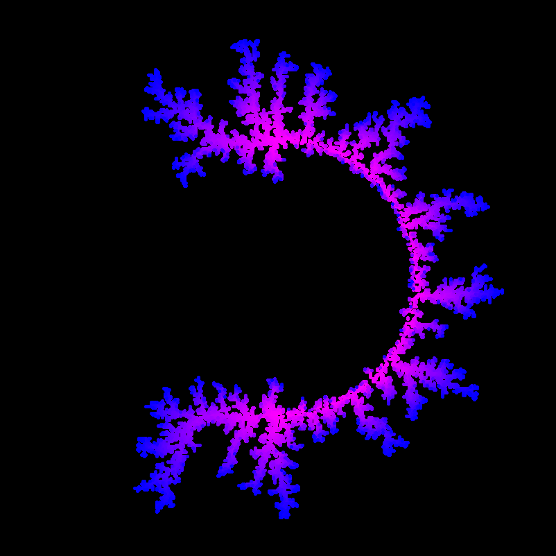

五生长中心，矩形边界，20k粒子

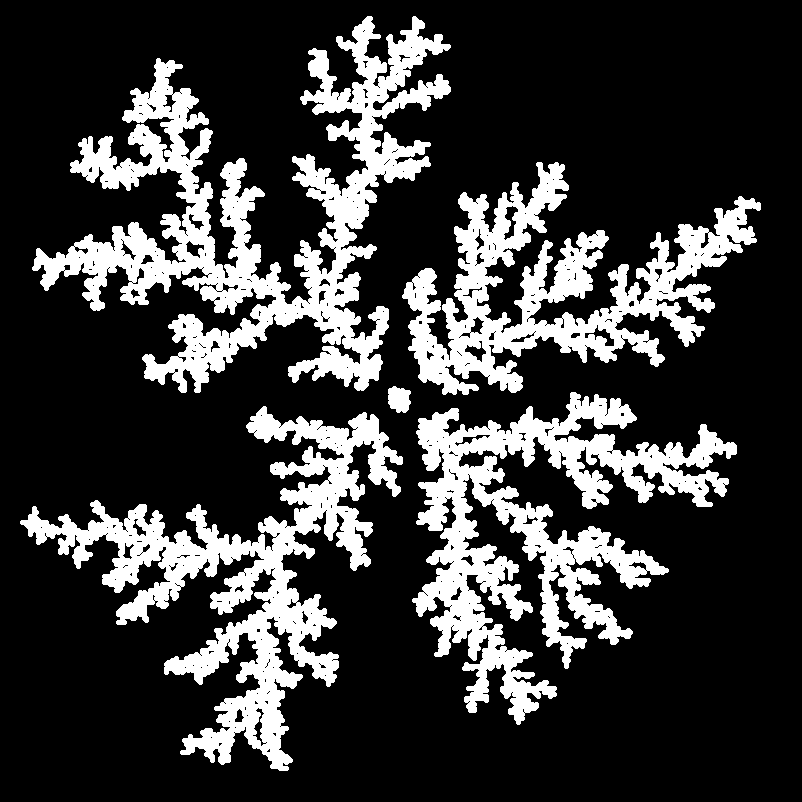

四生长中心，矩形边界，20k粒子

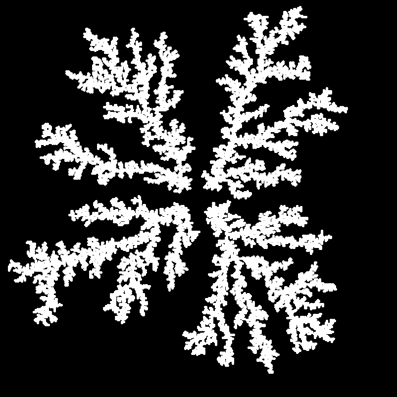

三生长中心，矩形边界，20k粒子

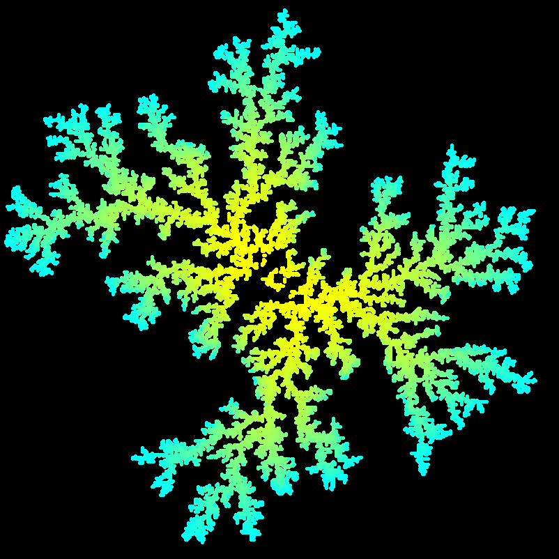

二生长中心，矩形边界，20k粒子

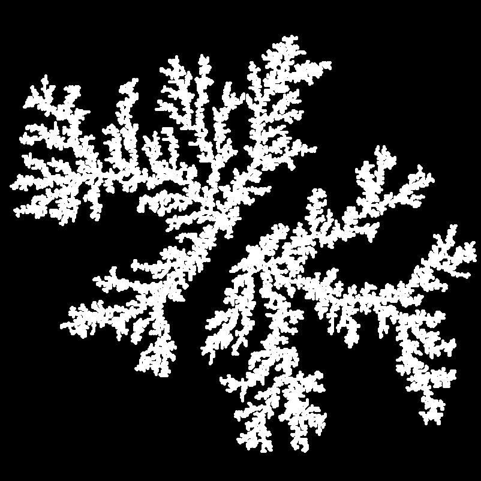

不对称的四生长中心，矩形边界，20k粒子

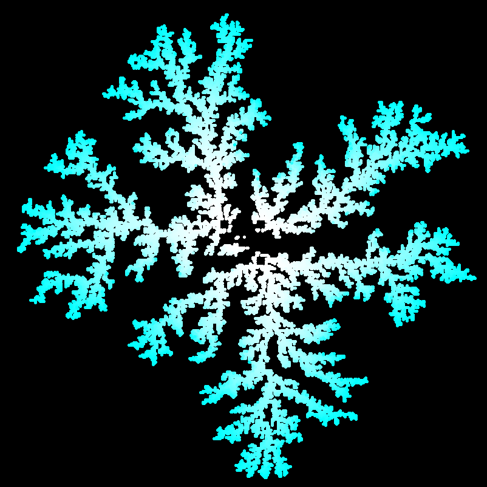

大区域多粒子，50k粒子

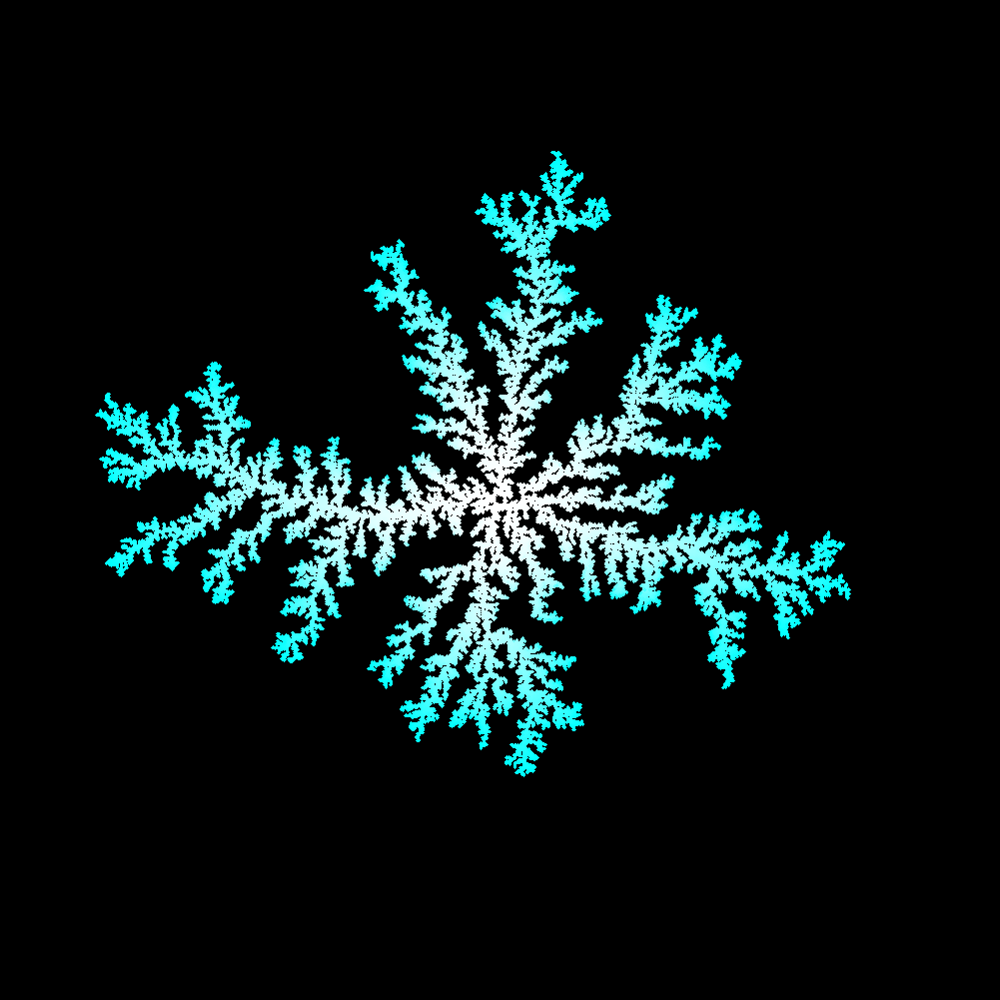

**结果分析**

从生长结果看，模拟结果是成功的，看到了生长中的分形模式。结果与理论上的结果类似。

从模拟中发现，如果有多个相邻的生长中心，那么它们的生长会相互排斥，而不会连接起来合成一个，尽管两个或多个生长中心相距非常近。如五中心的图中，可见中间的中心几乎没有得到生长，在开始生长后很快就被其他中心的生长围住，得不到新的粒子了。

对比矩形边界和圆形边界，直观看生长结果，发现矩形边界生长的粒子团偏向于矩形，而圆形边界生长结果较为对称，呈圆形；但二者差别并不很大。

**维数计算**

使用回转半径法计算。画出$R_g^2-N$对数图，舍去初始的随机性很大的点，进行线性拟合，斜率即为分形维数D。

一个对数图和线性拟合示例——10k粒子方形边界，舍去了前25%点，可见前一小部分点数虽少，但图上占据了大部分空间。D=1.157

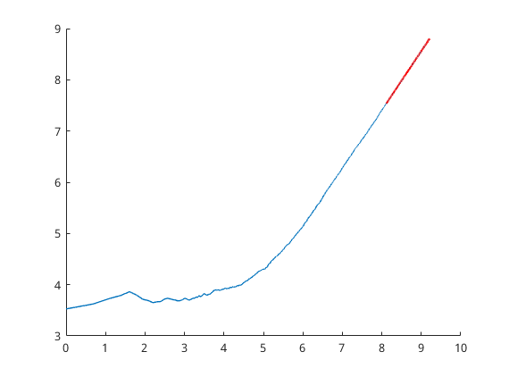

重复多次，发现几次求得的指数值为：

矩形边界：1.168, 1.172, 1.160, 1.151

圆形边界：1.171, 1.160, 1.176, 1.150

而线性拟合的标准差在0.0003左右。

可见，虽然每次模拟中，分形维数计算非常理想，线性拟合非常准确；但是在不同次模拟中，分形维数有较大的（0.01以上）差别。对于两种边界条件，不能判断哪个分形维数更大，看起来二者差别不大，都在1.15-1.18左右。

## 结论&其他

本次实验成功地进行了DLA生长模拟。结果较为理想，图像十分美观。

本次实验的程序设计中，使用了一些新的工具。首先，使用了OpenCV画图库。这是我第一次使用OpenCV，“现学现卖”，主要靠官网的文档例子和程序库中提供的例子学习，效果还是不错的。当然，这里只使用了OpenCV极小一部分的功能。因为使用OpenCV后编译指令变得复杂，这里写了一个简易的Makefile进行编译（本来想用cmake，但不是很熟悉并且和我的Vim自动补全插件结合不如Makefile所以就暂时放弃）。并且因为动态画图使程序运行速度下降，所以程序中使用了`NOVISUAL`宏定义来控制是否进行画图操作。如果编译时传入了这个参数（`CPPFLAGS=-DNOVISUAL make`），就会只输出结果，不画图，甚至根本而不需要OpenCV。程序内部还是和以前一样，有一个输出到stderr的简易进度条。数据输出到stdout，重定向到文件后由一个简单的Matlab脚本导入画图。