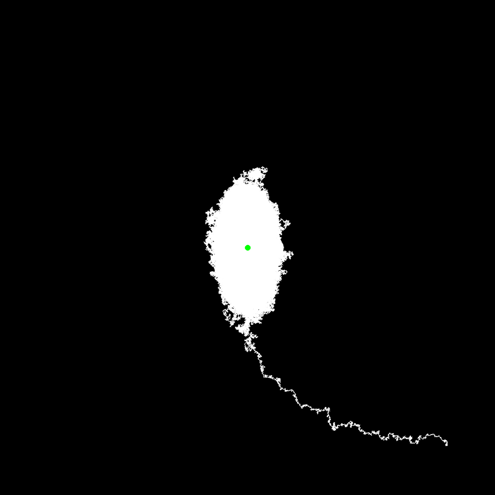
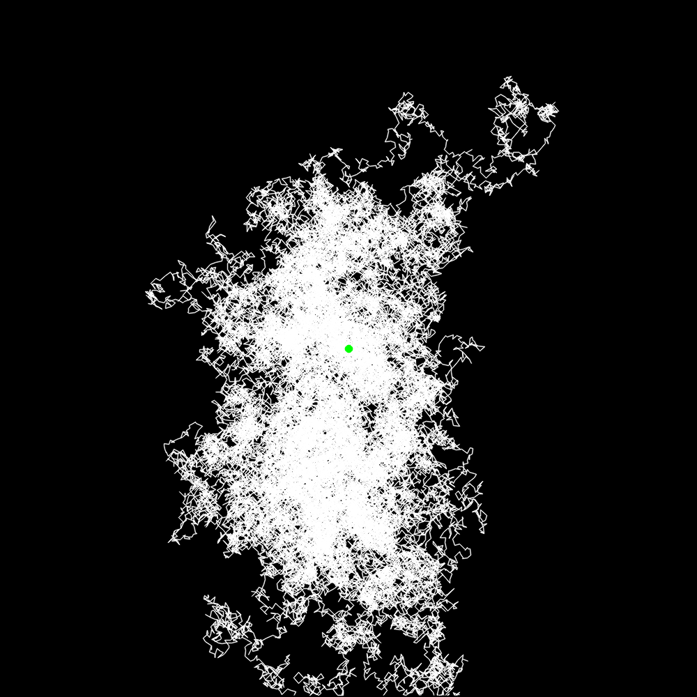
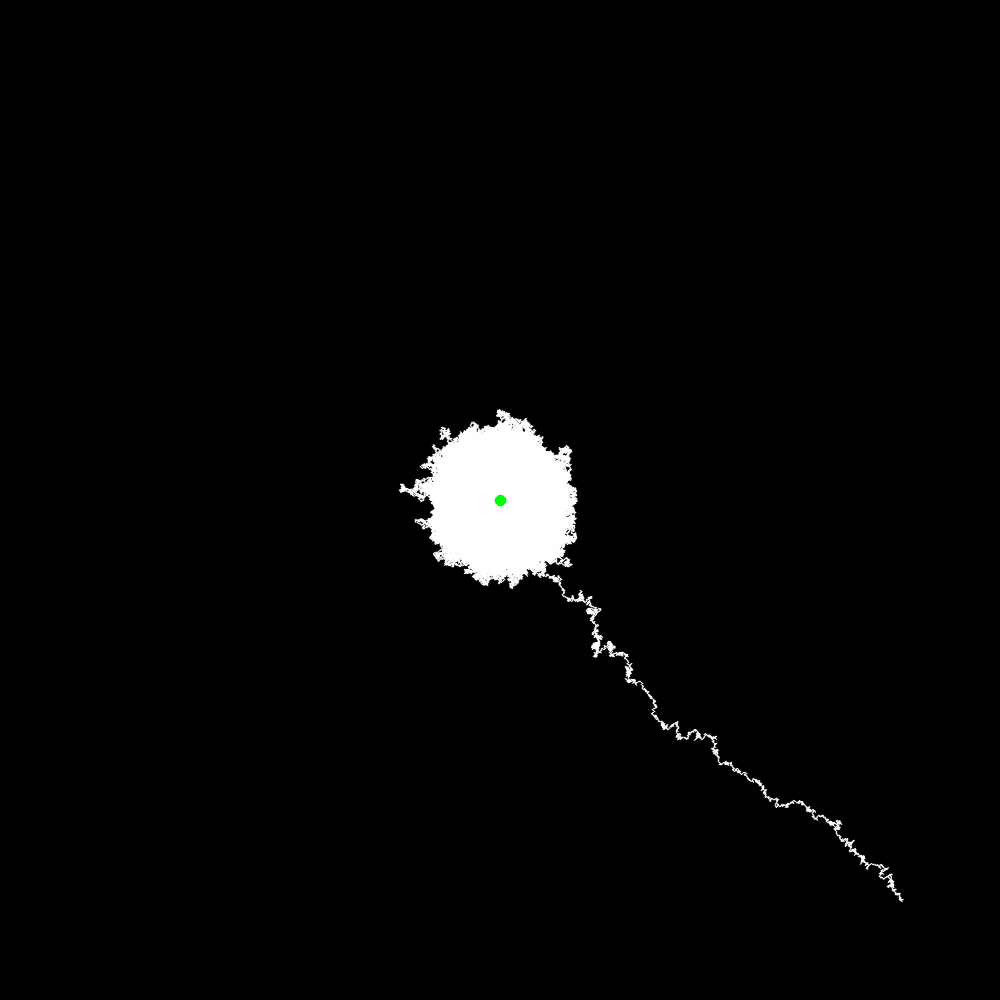

# HW16

古宜民

2019.12.11

## 题目

设体系的能量为 $H=x^{2} / 2 \sigma_{x}^{2}+y^{2} / 2 \sigma_{y}^{2}$（以kT为单位），采用Metropolis抽样法
计算$\left\langle x^{2}\right\rangle,\left\langle y^{2}\right\rangle,\left\langle x^{2}+y^{2}\right\rangle$ ，并与解析结果进行比较。抽样时在2维平面上依次标出Markov
链点分布，从而形象地理解Markov链。

## 分析&算法

**理论分析**

理论计算$\left\langle x^{2}\right\rangle,\left\langle y^{2}\right\rangle,\left\langle x^{2}+y^{2}\right\rangle$的解析结果。

体系的能量分布满足Boltzmann分布，概率密度为$P_{i}=\frac{1}{Z} e^{-H_{i} / k_{0} T}$，其中配分函数Z为：

$Z=\int_{-\infty}^{+\infty} \int_{-\infty}^{+\infty} e^{-\left(\frac{x^{2}}{2 \sigma_x^2}+\frac{y^{2}}{2 \sigma_y^2}\right)} d x d y=2 \pi \sigma_{x} \sigma_{y}$

所以空间概率分布为：

$P(x, y)=\frac{e^{-\left(\frac{x^{2}}{2 \sigma_x^2}+\frac{y^{2}}{2 \sigma_y^2}\right)}}{2 \pi \sigma_{x} \sigma_{y}}$

对于力学量A，其系综平均值为：

$\langle A\rangle= Z^{-1} \int A(\mathbf{q}, \mathbf{p}) e^{-\beta H(\mathbf{q}, \mathbf{p})} d \Omega$，

在本二维情况下即为：

$\left\langle x^{2}\right\rangle=\int_{-\infty}^{+\infty} \int_{-\infty}^{+\infty} x^2 e^{-\left(\frac{x^{2}}{2 \sigma_x^2}+\frac{y^{2}}{2 \sigma_y^2}\right)} d x d y= \sigma_{x}^2$

$\left\langle y^{2}\right\rangle=\int_{-\infty}^{+\infty} \int_{-\infty}^{+\infty} y^2 e^{-\left(\frac{x^{2}}{2 \sigma_x^2}+\frac{y^{2}}{2 \sigma_y^2}\right)} d x d y= \sigma_{y}^2$

$\left\langle x^{2}+y^2\right\rangle=\int_{-\infty}^{+\infty} \int_{-\infty}^{+\infty} (x^2+y^2) e^{-\left(\frac{x^{2}}{2 \sigma_x^2}+\frac{y^{2}}{2 \sigma_y^2}\right)} d x d y= \sigma_{x}^2+\sigma_y^2$

具体的数值要取定$\sigma_x$和$\sigma_y$才能确定。

**程序实现**

使用Metropolis方法进行模拟。对于一个状态，每次迭代（Markov链向前走一步）从该状态生成一个新状态（对其x与y座标加上一个在[-a, a]中均匀分布的随机值，这里取a=0.1），计算能量，如果新状态的能量高于旧状态，则以$w=e^{-\Delta E}$的概率接受新状态，$1-w$的概率拒绝。如果新状态能量低于旧状态，则100%接受新状态。

模拟中，选取总步数N=5000000，预热步数（初始化用，在最后计算时舍去）Nskip=100000，随程序运行在线计算待求量的平均值，用后的状态不保留。

同时使用OpenCV进行二维平面上的Markov链点分布。

## 模拟结果

**结果概览**

$\sigma_x=1, \sigma_y=2$的三次模拟结果，从上到下是$\left\langle x^{2}\right\rangle,\left\langle y^{2}\right\rangle,\left\langle x^{2}+y^{2}\right\rangle$

```
x2avg: 0.98373（理论值1）
y2avg: 4.11766（理论值4）
x2py2avg: 5.10139（理论值5）

x2avg: 0.967797
y2avg: 3.93284
x2py2avg: 4.90064

x2avg: 1.00191
y2avg: 3.89229
x2py2avg: 4.8942
```

一次模拟的图像：



点数较少时放大图像：



$\sigma_x=1, \sigma_y=1$的三次模拟结果，从上到下是$\left\langle x^{2}\right\rangle,\left\langle y^{2}\right\rangle,\left\langle x^{2}+y^{2}\right\rangle$

```
x2avg: 1.01931（理论值1）
y2avg: 0.9763（理论值1）
x2py2avg: 1.99561（理论值2）

x2avg: 0.997186
y2avg: 0.964969
x2py2avg: 1.96216

x2avg: 0.976273
y2avg: 0.996528
x2py2avg: 1.9728
```

一次模拟的图像：



**结果分析**

从图像上看，开始时粒子的状态远离平衡位置，随着模拟步数增加，粒子迅速趋于平衡位置，并在之后一直在平衡位置附近的区域内运动。只要我们选取的预热时间保证了粒子走到平衡位置附近，就可以满足要求。如果预热结束后粒子还离平衡位置较远，则需要增加预热时间。从数据看，我们选取的预热时间已经足够长。

对于$\sigma_x=1, \sigma_y=2$的情况，理论值为$\left\langle x^{2}\right\rangle=1,\left\langle y^{2}\right\rangle=4,\left\langle x^{2}+y^{2}\right\rangle=5$，有约2%-4%的误差。并且因为$\sigma_x和\sigma_y$不等，可以清楚的在图像上看到游走轨迹上y方向展宽较大，x方向展宽较小，总体轨迹历史成椭圆型。

对于$\sigma_x=1, \sigma_y=1$，理论值$\left\langle x^{2}\right\rangle=1,\left\langle y^{2}\right\rangle=1,\left\langle x^{2}+y^{2}\right\rangle=1$，x与y对称，轨迹成圆形。误差为1%-3%左右。

如果减小模拟点数，减小至500000点，则$\sigma_x=1, \sigma_y=1$的误差约为2%-5%，而$\sigma_x=1, \sigma_y=2$中$\langle y^2\rangle$的误差上升至了约10%-15%。可见当$\sigma_x$和$\sigma_y$增大时，在模拟点数较少是误差会增大很快，需要更多的模拟步数才能得到可以接受的结果。

三次运行的结果：

```
1,1
x2avg: 1.04688
y2avg: 1.02083
x2py2avg: 2.06771

x2avg: 0.997932
y2avg: 0.980587
x2py2avg: 1.97852

x2avg: 0.953336
y2avg: 1.05201
x2py2avg: 2.00535

1,2
x2avg: 0.992074
y2avg: 4.39254
x2py2avg: 5.38461

x2avg: 1.00193
y2avg: 3.23476
x2py2avg: 4.23668

x2avg: 0.948397
y2avg: 4.44338
x2py2avg: 5.39178
```

## 结论&其他

本次实验中成功地使用Metropolis重要抽样算法模拟了Boltzmann分布的粒子位置分布，结果与理论计算的预期相符。同时可视化地描述了二维Markov链的图像，形象地看到了Metropolis抽样的过程和粒子的位置分布。