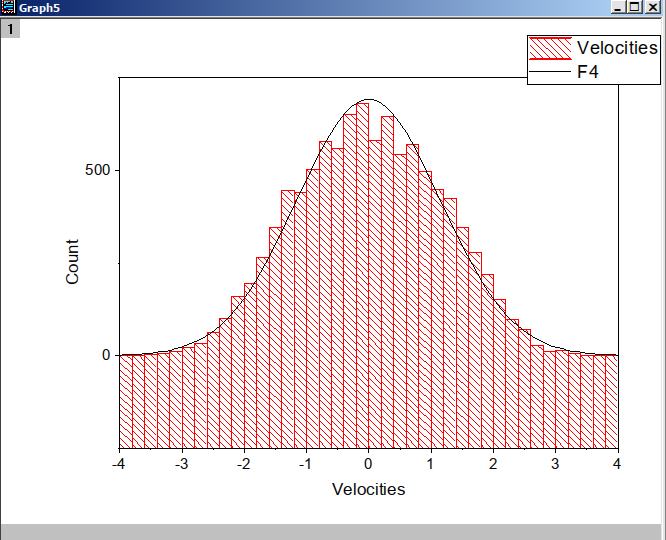
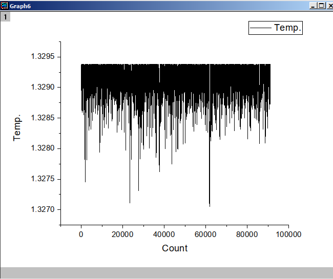
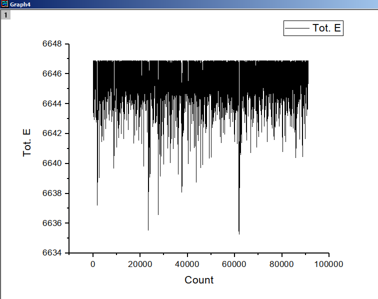
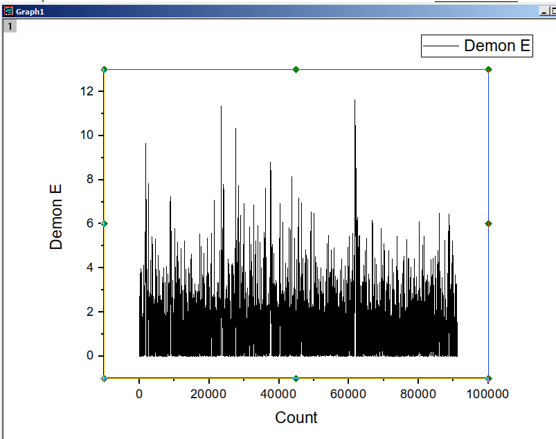

# HW17

古宜民

2019.12.11

##  题目

考虑一维经典粒子组成的理想气体，由于无相互作用，各粒子的能量不依赖于
其位置，只需考虑它的动能，因此体系的构型即是各粒子速度坐标值的集合。给定粒子
的质量、初始速度、总粒子数、总能、demon能，模拟足够多步后达到平衡时的粒子速度
分布。微正则系综中没有定义温度，其数值由$\frac{1}{2} k T=\frac{1}{2} m\left\langle v^{2}\right\rangle$给出，求平衡时的温度值。

## 分析&算法

**理论分析**

本题目是对微正则系综的Monte Carlo模拟。算法使用讲义上描述的Creutz等开发的使用一个额外自由度（demon）和包含很多粒子（即自由度）的体系交换能量。模拟过程如下：

- 初始化粒子的初速度为均匀分布
- 每一步模拟随机选取一个粒子，进行尝试移动，形成新构型，计算能量变化
- 如果能量降低，则接受，并把增加的能量交给demon
- 如果能量增加，则检查demon能否提供这些能量，如果能则能量从demon转移给系统，否则拒绝移动，系统不进行改变。

在很多步模拟后，力学体系和demon将达到平衡，系统的能量分布应满足Boltzmann分布。

**程序实现**

程序实现上只要按照理论流程进行模拟即可。初始速度的分布和每一步改变状态的速度变化大小为程序可改变的参量，但不应该影响最终的统计结果。模拟结束后使用直方图等统计粒子的速度和能量概率分布。粒子数目P=10000，模拟步数N=100000。

## 模拟结果

**结果分析**

在100000步模拟后，计算粒子的平均速度和方差、粒子尝试移动的接受率。

一次模拟的结果为（初始速度分布为[0，2]内的均匀分布）：

```
Average velocity: -0.00446266
velocity variances: 1.32926
Acception rate: 0.91185

```

作出速度分布直方图，并用高斯分布进行对比，高斯分布为：

$f(x | \mu, \sigma)=\frac{1}{\sqrt{2 \pi \sigma^{2}}} e^{-\frac{(x-\mu)^{2}}{2 \sigma^{2}}}$

其中$\sigma^2=1.32926$，$\mu=-0.00446266$。

用于对比的函数为缩放后的高斯分布，$f'(x)=P \Delta x f(x)$，其中P为粒子数10000，$\Delta x$为直方图的桶大小(bin size)，这里是0.2。

得到的图像为：



可见速度分布与理论值非常相符。

对系统的温度、总能量、Demon的能量随时间（步数）变化作图，如下：

温度、总能量、Demon能量：







从图中可见，大部分时候系统的温度较高、能量较大，而Demon的能量较小。只有在一些较小的时刻，Demon获得的较大的能量，而系统能量较低（温度较低）。但从前两张图可见系统温度和总能量变化其实非常小，约为总值的百分之一，而总粒子数P=10000，也验证了涨落的量级在$\frac{1}{\sqrt{P}}$。

## 结论&其他

本次实现了使用demon进行Monte Carlo模拟微正则系综，并对最终平衡分布时粒子的分布，以及涨落的量级进行了验证，结果与理论相符。

