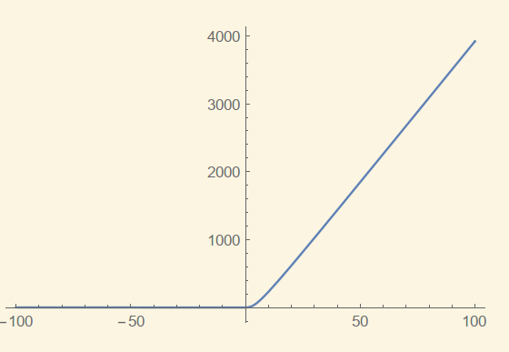
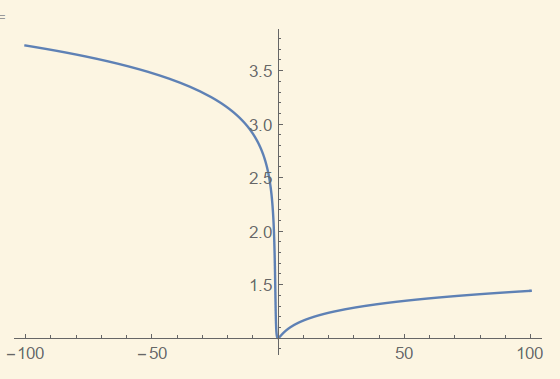
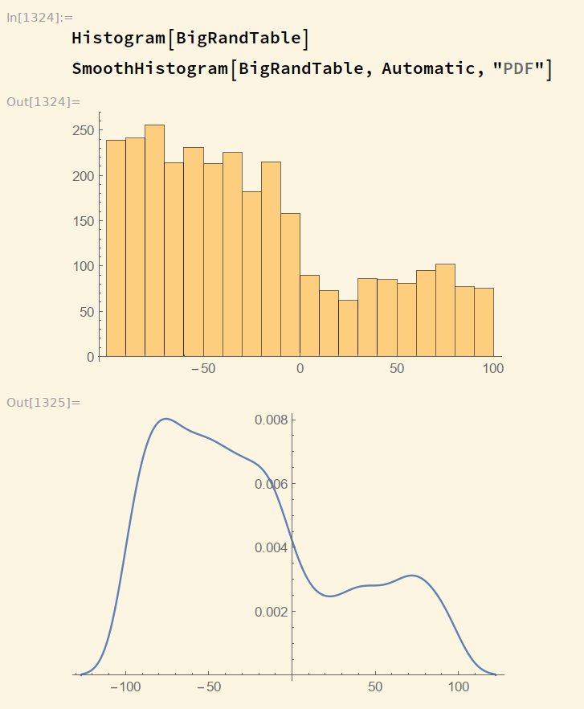

# HW4

**PB17000002 古宜民**

**2019.9.26**

取不同组a,b,c,d值，带入微分方程，随意指定边界条件（如p(0)=1）用Mathematica NDSolve求解，发现当x趋近于无穷或负无穷时，p(x)趋于无穷大，不可能满足概率守恒条件，所以只能取一定区间进行积分。

[a,b,c,d]=1,-1,5,-5

[a,b,c,d]=10,19,10,0

比如取区间[-100,100]内,[a,b,c,d]=10,19,10,0进行随机抽样。

首先归一化p，$A=\int_{-100}^{100}p(x)dx=467.991$, 归一化除以A，得到了p的数值表达式。

为了进行抽样，求p(x)的概率分布函数F(x)。本处用Mathamatica积分定义函数。如F(-100)=0.0,F(0)=0.718118,F(100)=1.

进行抽样时，要对F(x)求反函数$F^{-1}(x)$，然后抽取[0,1]区间随机数t，$F^{-1}(t)$为抽得的按p(x)分布的满足要求的随机数。为了简单起见，我只用了mathematica的FindRoot函数作为求反函数的方法，因为F是单调函数。这样完全没有考虑效率问题。正常的方法应该是对$F^{-1}$建立数值插值函数，只要一次建立就可以在使用是快速用来生成随机数。

生成了3000个随机数，对其作直方图和mathematica预测的概率可见其分布形式和原本抽样的p(x)符合，我们的抽样是正确的。但因为x=0附近p(x)变化过大，点数并不多，所以验证结果并不精确。

