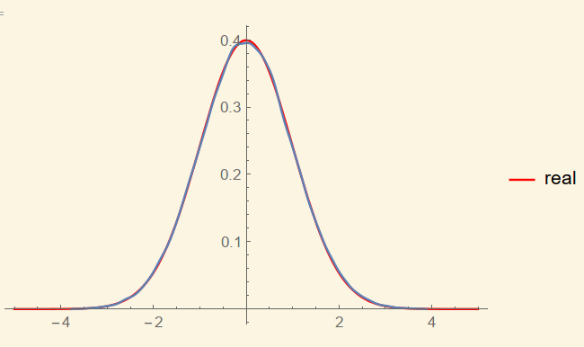
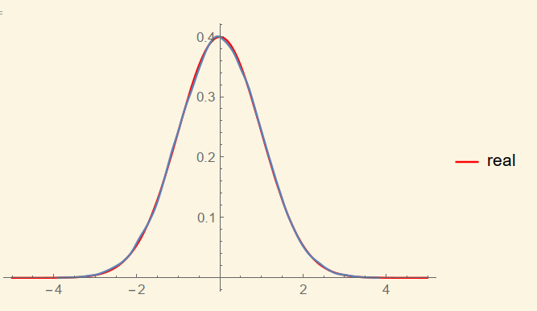

# HW6

**古宜民 PB17000002**

**2019.9.29**

## 题目

[第6题]:对两个函数线型( Gauss 分布和 类 Lorentz 型分布),设其一为 p(x) ,另一为
F(x) ,用舍选法对 p(x) 抽样。将计算得到的归一化频数分布直方图与理论曲线 p(x) 进行
比较,讨论差异。讨论抽样效率。

## 分析

按题目要求，对Gauss分布进行舍选法抽样和舍选法+变换抽样法抽样，对比二者的抽样效率。

**舍选法+变换抽样法抽样（task1）**

取抽样范围为[-5, 5]，归一化后的概率密度函数为

$p(x)=0.398943 e^{-\frac{x^2}{2}}, x\in[-5,5]$

对于F(x)的取值，要保证在抽样区间内恒有$p(x)<F(x)$。F(x)为Lorentz分布，

$F(x)=\frac A{1+x^4}$

A的值需要保证满足条件并且尽可能小，因为这样才能在可以的范围内最大地提高采样效率。

但直接计算一个Lorentz分布和类Gauss分布的差保证其为正比较困难，于是通过Mathematica计算得到$\frac A{1+x^4}-e^{-\frac{x^2}{2}}$在B=2.4时能满足恒>0，而B=2.3时不满足，于是取B=2.4，对应A=0.398943B=0.957463，取A=0.96. 

确定p与F后进行变换抽样。

F的概率分布函数为：

$$
P(x)=\int_{-5}^xF(x)dx=G(x)-G(-5), \\

其中G(x)=A\frac{1}{4\sqrt2}(-log(x^2-\sqrt2x+1)+log(x^2+\sqrt2x+1)\\
-2tan^{-1}(1-\sqrt2x)+2tan^{-1}(\sqrt2x+1))
$$

P的反函数不易求，但因为P单值，程序上可以用二分法比较快速的求得。通过流程

$随机\alpha\in[0,P(5)]->\beta=P^{-1}(\alpha)$

可以得到F(x)曲线下的随机抽样。再抽取$[0,\alpha]$内随机数$\gamma$，按是否满足$\gamma<p(\beta)$进行取舍。如果取，那么之前计算的$\beta$就是概率密度函数p(x)的随机抽样。

**直接舍选法抽样（task2）**

比较简单，因为在所取范围内p(x)在0处取最大值为0.398943，只要抽取两个[0,1]区间内的随机数(x,y)，判断(-5+10x,0.398943y)在不在Gauss分布曲线下方，决定取舍。

## 计算结果

从计算结果可见，进行300000次尝试，task1接受率为47%左右，而task2接受率仅有25%左右。可见在抽样效率上辅助以变换抽样的效果更好。在计算速度上，task1用时1.42秒（二分法精度1e-5）或0.47秒（二分法精度1e-3），task2用时0.06秒，task1因为复杂的数学函数计算用时远大于task2。所以从实际应用的考虑，本情况下还是直接舍选法抽样效率更高。

但如果对于其他能够求得反函数的F(x)，可能使用变换+舍选抽样效率更高。

对输出的随机数用Mathematica作图（SmoothHistogram），再作真实分布的图，可见二者非常接近（红色为理论分布，蓝色为实际分布）。我们的两种抽样方法都是正确的。

task1图，有效点在150000左右

task2图，有效点在75000左右

## 结论

本次采用的两种抽样方法都能正确的产生样本，相比较而言，变换+舍选抽样接受率高，但因为计算代价太高，总体结果反不如简单、适用范围广的直接舍选抽样。但特定情况下，比如概率密度分布p(x)更加不均匀，或是反函数能够计算或抽样方便，那么变换+舍选抽样可能是更好的选择。哪种方法更好要视情况而定，而若使用变换，变换函数的选取十分重要。如果不使用类Lorentz线型，而是直接用简单地分段函数作为F(x)，很可能在牺牲极少量时间的情况下对样本生成效率有较为明显的提升，可能是对Guass分布舍取抽样更好的选择。