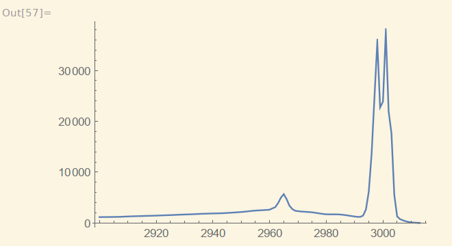
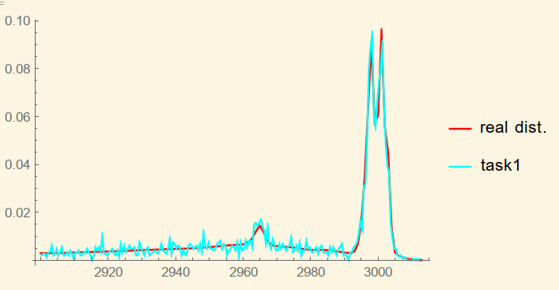
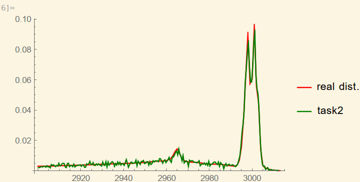
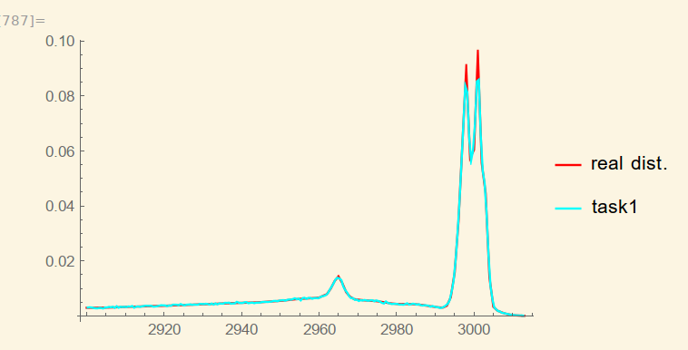
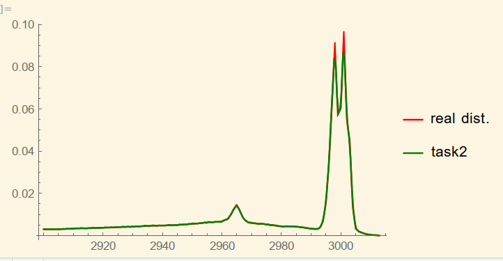

# HW7

**古宜民**

**2019.10.1**

## 题目

[第7题]:对一个实验谱数值曲线 p(x) ,自设 F(x) ,分别用直接抽样和舍选法
对 p(x) 抽样。比较原曲线和抽样得到的曲线以验证。讨论抽样效率。

## 思路方法

首先在Mathematica中导入数据绘图，发现概率分布图形在x=2965处有一小峰，高为5672，在2998、3001处有两个高峰，高为35560、37630，整体图像很不均匀。对这个p(x)进行直接抽样和舍选抽样。

由于data.TXT给出的p(x)为离散值，对于中间的值，可以用两侧给出的值进行线性插值得到。

对于p(x)的归一化问题，在程序抽样中不需要，但是画图时需要。用插值函数简单计算可得$\int_{2900}^{3013}p(x)dx=395418.5$

简单抽样只要在$[2900,3013]\times[0,35560]$内随机取点，然后判断点在曲线上方或下方进行取舍即可。

对于舍选抽样的F(x)设计，考虑简单的二段分段函数，第一段的值为小峰峰值5672，第二段峰值为大峰峰值37630。为了保证F(x)>=p(x)，可以取分段点在x=2994，即：
$$
F(x)=\left\{
\begin{aligned}
5672&,&  2900\le x\le 2994  \\
35560&,&  2994 \lt x \le 3013 \\
0&,& o.w.
\end{aligned}
\right.
$$
为了生成按F(x)分布抽样值，对F(x)积分后取反函数，由于F(x)为分段常值函数，积分后的反函数非常简单，为
$$
G(x)=\left\{
\begin{aligned}
\frac{2994-2900}{533168}x+2900&,&0\le x\le 533168 \\
\frac{3013-2994}{1208808-533168}(x-533168)+2994&,&533168\le x\le 1208808
\end{aligned}
\right.
$$
其中各个值的含义是，
$$
533168=(2994-2900)*5672\\
1208808=533168+35560*(3013-2994)
$$
和HW6中的舍选法类似，抽取p1为[0,1208808]范围内随机数，x0=G(x)为按F(x)概率密度函数分布的x值，再抽取[0,F(x0)]中随机值，判断其是否小于p(x0)决定取舍。

## 计算结果

两种抽样方法的接受率为直接抽样9.8%，舍选法抽样32.8%。可见舍选法抽样在本情况下大幅提升了抽样效率，但还有很大提升空间。如果将分段函数分成更多段，还能够提升效率。

计算时间为，进行3000000次尝试，直接时间0.26s，舍选时间0.68s，考虑时间开销后，总效率是舍选法更好。这和hw6中的结果相反，本次情况下舍选法发挥了优势。

将抽样结果输入mathematica进行直方图计算，再将计算好的直方图和原概率分布进行作图比较，可见二者符合的相当好。

直接抽样，30000尝试

舍选法，30000尝试

直接抽样，3000000尝试

舍选法，3000000尝试

可以清晰的看到，30000尝试时由于有效点数差别，舍选法波动小于直接抽样，而3000000点时，两种方法和真实分布均无肉眼可见差别。至于两个尖峰处的差异，很可能是因为直方图桶大小选择导致的。

## 结论&其他

两种抽样方法都能满足题目要求，在本题条件下舍选法抽样效果优于简单抽样。

本次作业的代码其实20分钟就完成了，大部分时间都花在了mathematica作图等内容上。

本次作业的代码其实20分钟就完成了，大部分时间都花在了mathematica作图等内容上。

另外，通过小脚本自动化操作，重定向输入输出能让编程过程更加轻松。