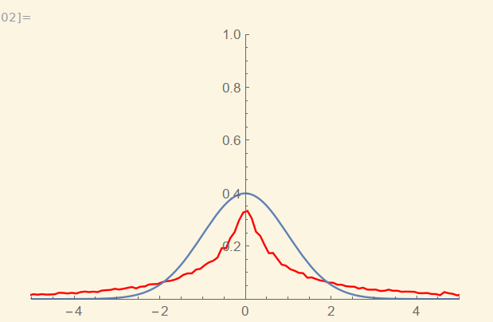
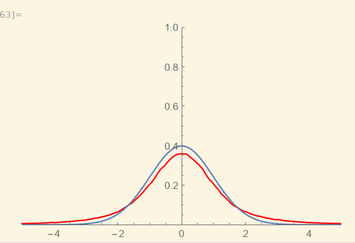
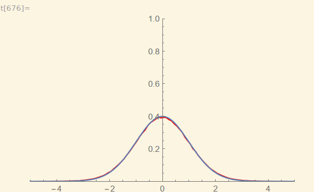
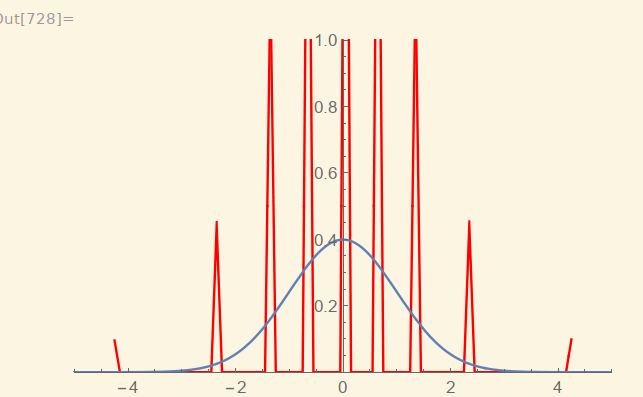
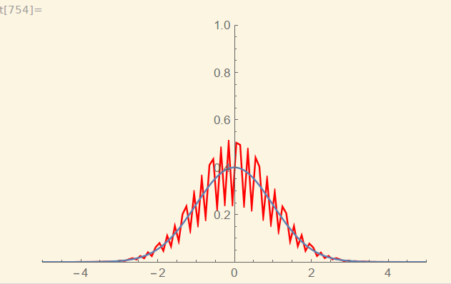
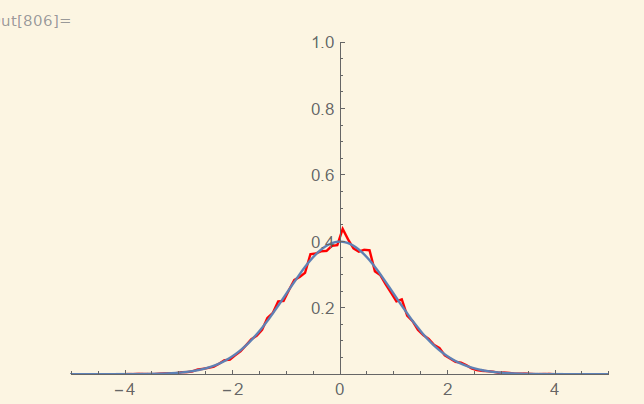
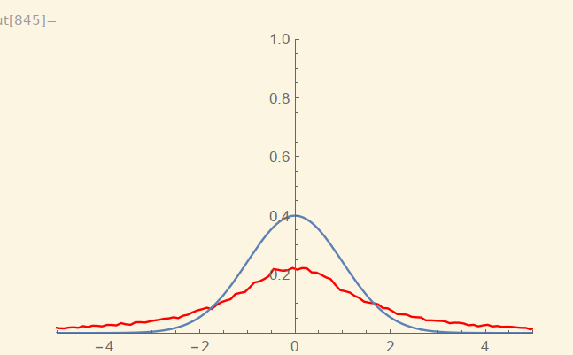
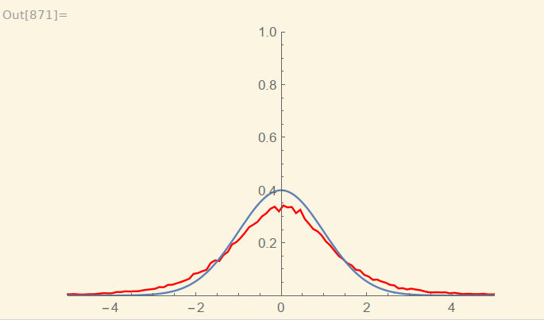
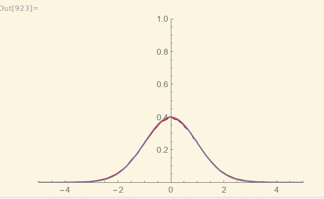

# HW9

## 题目

用Monte Carlo 模拟验证中心极限定理。

## 方法

设若干个随机分布f，求出其期望值$\mu$，对每个随机分布进行多次(N)抽样，计算变量$|\frac{<f>-\mu}{\sigma_f/\sqrt N}|$的值。再对此过程进行M次，得到M个样本，作统计直方图查看概率分布情况，与标准正态分布进行对比。

取分布为：f1为[0,1]内均匀分布；f2为二项分布0或1，概率各为0.5；f3为Guass正态分布，$\mu$=0，$\sigma$=0.1，用Box-Muller法抽样。

取不同量级的N，查看作图情况：

**均匀分布**

N=2

N=5

N=50

可见随N增大，均匀分布趋于标准正态分布。

**二项分布**

N=10

N=1000

N=50000

可见结论仍然成立，但是趋于正态分布的速度明显变慢，N较小时还有明显的二项分布尖峰的特点，N=50000时也没有像均匀分布那样快速地趋于标准正态分布，而是有些小偏差。

**正态分布**

N=2

N=5

N=50

同样，趋于标准正态分布。

## 结论

通过三个函数f1，f2，f3，验证了中心极限定理的成立。而趋近于标准正态分布的速度是与函数f的分布相关的。

另外，考虑到程序运行速度的开销，上面不同图的采样点数不同，为图片文件中的第二个数，有的为50k，有的为500k。因为如果N过小，可能导致计算后的数据（即程序输出的数据）范围极大，甚至有无穷大存在（比如二项分布几次抽样结果相同，方差为0），这时mathematica画图速度会很慢，所以被迫把采样点数减少了一个量级。